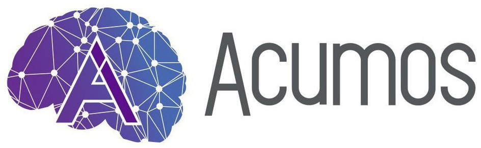

.. ===============LICENSE_START=======================================================
.. Acumos CC-BY-4.0
.. ===================================================================================
.. Copyright (C) 2017-2020 AT&T Intellectual Property & Tech Mahindra. All rights reserved.
.. ===================================================================================
.. This Acumos documentation file is distributed by AT&T and Tech Mahindra
.. under the Creative Commons Attribution 4.0 International License (the "License");
.. you may not use this file except in compliance with the License.
.. You may obtain a copy of the License at
..
..      http://creativecommons.org/licenses/by/4.0
..
.. This file is distributed on an "AS IS" BASIS,
.. WITHOUT WARRANTIES OR CONDITIONS OF ANY KIND, either express or implied.
.. See the License for the specific language governing permissions and
.. limitations under the License.
.. ===============LICENSE_END=========================================================

====================
acumos-python-client
====================

|Build Status|

A client library that allows developers to push their Python models to Acumos.

See our `documentation <docs/user-guide.rst>`__ to get started.

.. |Build Status| image:: https://jenkins.acumos.org/buildStatus/icon?job=acumos-python-client-tox-verify-master
   :target: https://jenkins.acumos.org/job/acumos-python-client-tox-verify-master/
